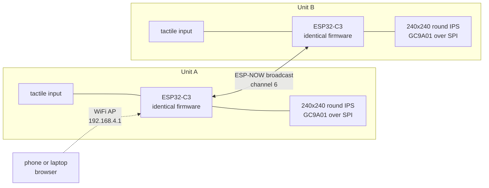

# Bobbie

Two paired keychains that let people at a distance feel each other's touch. Squeeze one and the other responds, in under 100 ms, over a direct radio link with no router, broker, phone or cloud anywhere in the path.

This repository holds the firmware and the hardware reference for the prototype units.

---

## Why it is built this way

The product constraint drove the architecture: two devices, given to two people who may be anywhere, that have to work out of the box with no setup.

That rules out most of the obvious designs. No account, so no backend. No pairing flow, so no per-device configuration. No assumption of a WiFi network at either end, so no router and no MQTT broker. What is left is two microcontrollers talking directly to each other, each hosting its own network for the times a phone needs to connect.

Everything below follows from that.

---

## Architecture

Each unit runs `WIFI_AP_STA`: a station interface, which ESP-NOW requires, plus its own access point named `bobbie-XXXX` with the suffix derived from the MAC. Identical firmware therefore still produces distinct network names.

---

## Three decisions worth reading

### 1. Broadcast addressing, so both units run identical firmware

Both units transmit to `FF:FF:FF:FF:FF:FF`. A radio never hears its own transmissions, so each unit only ever receives the other one.

The alternative was storing each unit's peer MAC address, which means a provisioning step, a per-device build, or a pairing UI. Broadcast removes all three. It also makes the classic twin-rig bug, where a unit ends up addressing itself, structurally impossible rather than something caught at runtime.

The cost is that this design does not extend to more than two devices in radio range. That is an accepted limit, not an oversight: the product is a pair.

### 2. Cutting a subsystem instead of upgrading the microcontroller

The display that arrived was the touch variant, which added a CST816S capacitive controller on I2C. That pushed the build to twelve required nets against eleven usable GPIO.

The obvious fix was a larger part. Instead the touch controller was removed, because at this stage it did nothing the tactile button could not. That freed four nets and, more importantly, the three ADC1 channels reserved for analog force sensing later. ADC2 silently returns zero once the radio starts, so ADC1 is the only option, and those channels were worth protecting.

`TP_RST` is tied to ground to hold the touch chip in permanent reset so it draws nothing. There is no I2C anywhere on this build.

### 3. All or nothing frame reassembly

Art frames are 60x60 pixels, 16 colours, 4 bits per pixel, so 1800 bytes. ESP-NOW carries 250 bytes per packet, so a frame ships as 8 packets of 240 with a 3 byte `[kind, index, total]` header.

The receiver assembles into a shadow buffer and swaps it into the live art only when all 8 chunks land. A dropped packet therefore yields nothing rather than half a picture. Degrading cleanly was chosen over degrading partially.

---

## Hardware

Board is a **Waveshare ESP32-C3-Zero**. Exposed GPIO are 0 to 10 and 18 to 21; GP11 to GP17 are internal flash.

| GPIO | Net | Note |
|---|---|---|
| GP0 | reserved | ADC1, held for `SQUEEZE_FSR` |
| GP1 | reserved | ADC1, held for `TUG_FSR` |
| GP2 | `LCD_BL` | Strapping pin, must boot high. 10k to 3V3, which also means backlight on |
| GP3 | `MOTOR_PWM` | 1k to NPN base, 10k to GND or it buzzes at every reset |
| GP4 | reserved | ADC1, held for `PIEZO` or a second button |
| GP5 | `LCD_SCLK` | SPI clock, 40 MHz |
| GP6 | `LCD_MOSI` | Silkscreen may read `SDA`. This is not I2C |
| GP7 | `LCD_DC` | Low is command, high is data |
| GP8 | `LCD_CS` | Strapping pin, must boot high. CS idles high, so it fits. 10k to 3V3 |
| GP9 | BOOT | Low at reset enters USB download mode. Left free |
| GP10 | `LED_STATUS` | Onboard WS2812 |
| GP18/19 | USB D- / D+ | Native USB, how the board is flashed. Never reuse |
| GP20 | `BTN_SQUEEZE` | UART0 RX, an input at boot anyway. `INPUT_PULLUP`, active low |
| GP21 | `LCD_RST` | UART0 TX pulses it at boot. The panel resets a few extra times |

**The two pull-ups are for the strapping pins, not the signals.** Both are 10k from the pin's node to 3V3, in parallel with the signal, never in series. Between power-on and the first line of `setup()`, GP2 and GP8 float, and the C3 requires them high at that instant. GP8 low at reset means the board does not boot at all, which presents as a dead board rather than an SPI fault. This is the most misdiagnosed failure on the whole build.

Power today is USB. When the LiPo lands it enters the **5V pin** through a boost converter; pin 3 is `3V3(OUT)`, an output from the onboard regulator, not an input.

---

## Firmware

Arduino / C++ on ESP32 core 3.x, using LovyanGFX.

LovyanGFX is configured in-sketch rather than through a global header: `Bus_SPI` with sclk 5, mosi 6, miso -1, dc 7 at 40 MHz, and `Panel_GC9A01` with cs 8, rst 21, 240x240. There is deliberately **no touch block**. Leaving `Touch_CST816S` configured but unwired makes the library poll a chip held in reset, and the I2C timeout blocks the loop. That presents as a slow display, not as a touch problem.

**Anti-flicker.** There is no `fillScreen` in the render path. Each arc paints a fixed annulus (r 94 to 112) with the lit portion in colour and the remainder in black, so it erases its own trail; the core blacks out only the ring it is shrinking from. Drawing is wrapped in `startWrite()` / `endWrite()` to hold a single SPI transaction, and levels are quantised to steps of 4 with a 30 ms floor between redraws. Roughly 25 fps instead of 80, visually identical.

**The shared display.** Left semicircle is you, right is them. Each half thickens and brightens with that person's hold duration. When both hold, a warm core blooms sized by `min(myLevel, theirLevel)`, so neither person can drive the shared element alone and it grows at the pace of whoever joined last.

### Packet kinds

| Kind | Meaning |
|---|---|
| `0xB0` | squeeze state |
| `0xB1` | art chunk |

### The app is served by the device

A `WebServer` on port 80 serves a 60x60 16-colour pixel art editor from flash at `192.168.4.1`.

| Route | Purpose |
|---|---|
| `GET /` | the drawing app, a `PROGMEM` string |
| `POST /frame` | 3600 hex chars to an 1800 byte buffer, draw locally, relay to peer |

The body is hex rather than raw binary because Arduino `String` is null-terminated, so a `0x00` byte in a binary body truncates it. `Access-Control-Allow-Origin: *` is set so the app can be iterated from a local file during development without reflashing.

---

## Toolchain notes

- Arduino IDE, board **ESP32C3 Dev Module**, **USB CDC On Boot = Enabled**. Without it the upload succeeds and the Serial Monitor stays silent forever.
- `ledcAttach(pin, freq, res)` and `ledcWrite(pin, duty)` are core 3.x. On 2.x it is `ledcSetup` plus `ledcAttachPin`.
- ESP-NOW receive callback on core 3.x is `(const esp_now_recv_info_t*, const uint8_t*, int)`. No send callback is registered; its signature changed between 3.1 and 3.2 and nothing here needs it.
- `min(100u, millis() - x)` will not compile. `std::min` is a template and `unsigned int` is not `unsigned long`. Clamp explicitly.
- **ESP-NOW only works between radios on the same WiFi channel, and it fails silently.** Both units call `esp_wifi_set_channel(6, ...)` and set `peer.channel = 6` explicitly, since 0 means "current". The boot screen prints the channel so it can be read rather than guessed.

---

## Bring-up order

Build one unit completely, then freeze it. No borrowed jumpers, no reflashing, no tidying its wires. Build the second from a photograph of the first. A known-good unit beside a broken one is what makes a fault findable by swapping one part at a time and watching whether it follows the part or stays with the board.

1. Blink and RGB, proving board, cable and toolchain before anything else can be blamed
2. Rails read 3.2 to 3.3 V before any signal wire goes in
3. Backlight PWM sweep only, proving power and the connector before SPI matters
4. SPI panel, `fillScreen(RED)`
5. Button, verified with a continuity beep before any firmware is blamed
6. ESP-NOW between two boards
7. Drawing app end to end
8. Motor last, on its own patch of board, tested with a bare GPIO toggle

Two cheap checks that save hours. A four-leg tactile switch has two legs shorted internally, so straddle the centre channel and confirm continuity beeps *only while pressed*. And a charge-only USB cable presents as a completely dead board, because power flows and data does not.

---

## Status

**Working**

- Two functionally identical prototype units
- ESP32-C3 firmware driving the 240x240 round IPS display
- Peer to peer ESP-NOW link, sub-100 ms
- Simultaneous-input detection rendering on both devices
- Device-hosted WiFi access point and HTTP server serving the drawing app

**In progress**

- Haptic feedback. Single NPN driver designed and laid out, not yet populated. Blocked on transistors
- End to end verification of the drawing app across both units
- Custom PCB, behind an interface freeze
- Battery integration and enclosure CAD
- Analog force sensing on the reserved ADC1 channels

---

## Team

Three people, with ownership defined rather than shared:

- **Ethan**: mechanical and prototype, system architecture, firmware
- **Ricky**: electrical and PCB
- **Leo**: software

---

## Licence

Not yet chosen. Treat this as all rights reserved until a `LICENSE` file appears.
